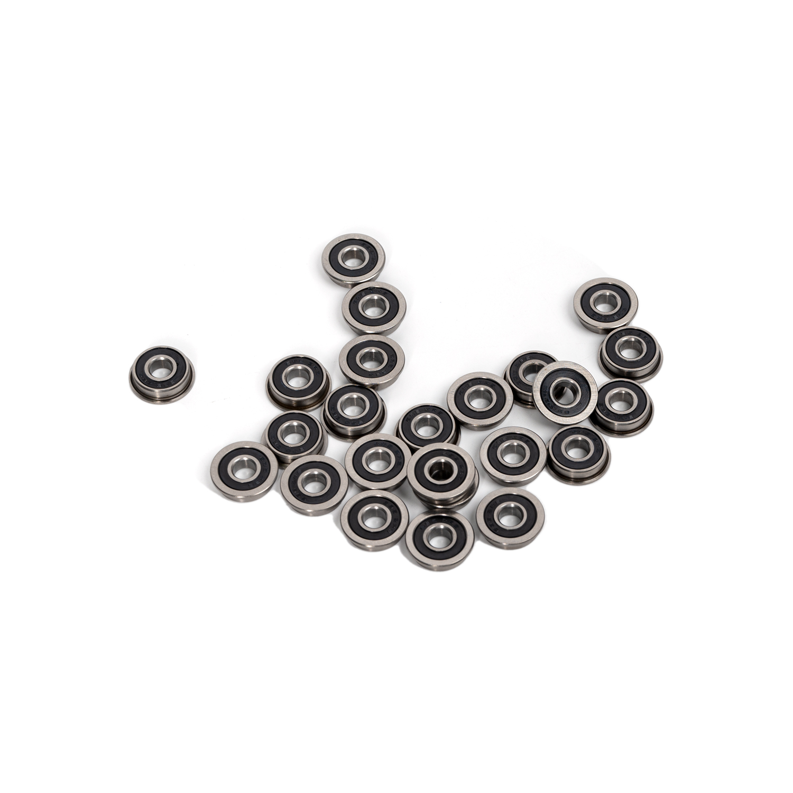

# LDO CNC AWD Kit by Mastur_Mynd and aTinyShellScript
CNC drive frames designed specifically for your [Voron Trident](https://github.com/VoronDesign/Voron-Trident)

## Things to consider
There are a few printed parts recommended for clean cable management. Head over to the STL directory to download these files and print what you'll need before prepping for installation.

It is recommended to get some channel covers for your front corner extrusions to hide the front motor wires on their way to the electronics bay.

Depending on the orientation of the front motor mounts and the toolhead assembly, some amount of printable area will be lost at the front corners of the build plate. The below table will be updated as data comes in. If you would like to contribute to this table please submit a pull request or create an issue with dimensions for both the Voron Trident and the Voron V2.4r2.

---
| Toolhead | X Loss (mm) | Y Loss (mm) |
| --- | --- | --- |
| Stealthburner | 17.8 | 47.6 |

## So what's in the box?!
Note that the Contents section of the [assembly manual](assembly_manual.pdf) accounts for individual hardware components. For an improved assembly experience some components are preinstalled.

---
| Qty | Part Name | Image |
| --- | --- | --- |
| 1 | Front A Drive Frame Lower |  |
| 1 | Front A Drive Frame Upper |  |
| 1 | Front B Drive Frame Lower |  |
| 1 | Front B Drive Frame Upper |  |
| 1 | Rear A Drive Frame Lower |  |
| 1 | Rear A Drive Frame Upper |  |
| 1 | Rear B Drive Frame Lower |  |
| 1 | Rear B Drive Frame Upper |  |
| 24 | F695-2RS Bearing |  |
| 4 | Pulley |  |
| 8 | Shim Pin - Threaded (M3) |  |
| 4 | Shim Pin - Unthreaded |  |
| 4 | Standoff |  |
| 2 | Tensioner Block |  |
| 2 | Tensioner Slide |  |
| 2 | Tensioner Wedge |  |
| 6m | Open Belt, GT2, 6mm |  |
| | All hardware necessary to assemble |  |