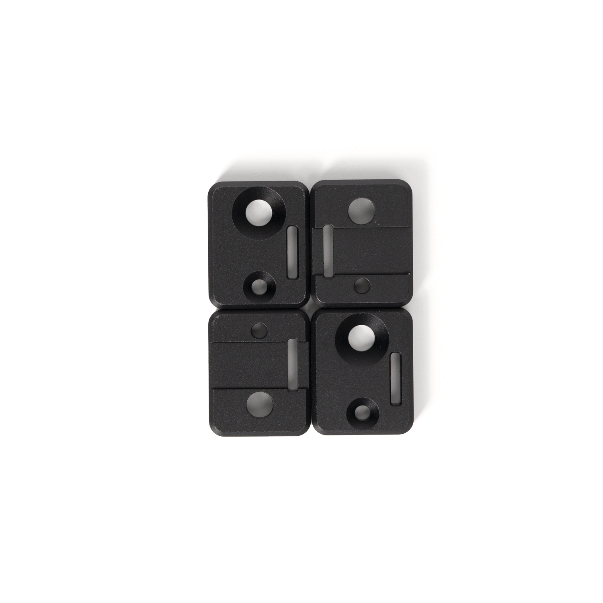

# LDO CNC AWD Kit by Mastur_Mynd and aTinyShellScript
CNC drive frames designed specifically for your [Voron V2.4](https://github.com/VoronDesign/Voron-2)

## Things to consider
There are a few printed parts recommended for clean cable management. Head over to the STL directory to download these files and print what you'll need before prepping for installation.

It is recommended to get some channel covers for your Y extrusions. This will prevent the motor wires from rubbing against the belts.

## So what's in the box?!
Note that the Contents section of the [assembly manual](assembly_manual.pdf) accounts for individual hardware components. For an improved assembly experience some components are preinstalled.

---
| Qty | Part Name | Image |
| --- | --- | --- |
| 1 | Front A Drive Frame Lower |  |
| 1 | Front A Drive Frame Upper |  |
| 1 | Front B Drive Frame Lower |  |
| 1 | Front B Drive Frame Upper |  |
| 1 | Rear A Drive Frame Lower |  |
| 1 | Rear A Drive Frame Upper |  |
| 1 | Rear B Drive Frame Lower |  |
| 1 | Rear B Drive Frame Upper |  |
| 26 | F695-2RS Bearing |  |
| 6 | Pulley |  |
| 8 | Shim Pin - Threaded (M3) |  |
| 4 | Shim Pin - Unthreaded |  |
| 4 | Belt Clamp A |  |
| 4 | Belt Clamp B |  |
| 4 | Standoff |  |
| 2 | Tensioner Block |  |
| 2 | Tensioner Slide |  |
| 2 | Tensioner Wedge |  |
| 6m | Open Belt, GT2, 6mm |  |
| | All hardware necessary to assemble |  |